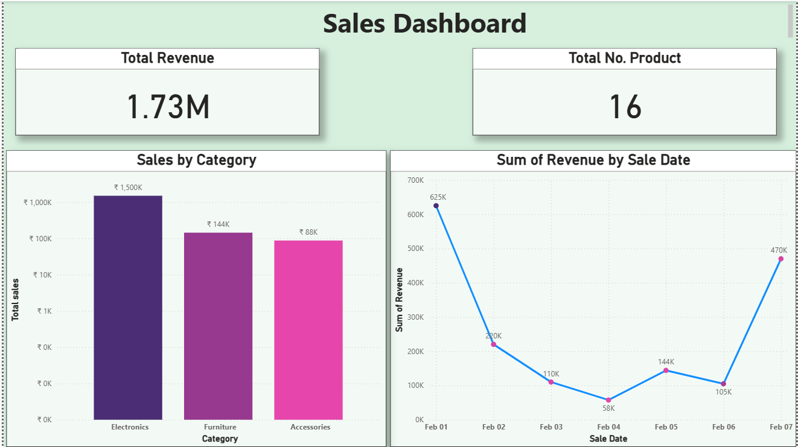

# 📊 Sales Performance Dashboard | Power BI & MySQL

## 🚀 Project Summary
Built an end-to-end **Sales Performance Dashboard** using **Power BI** connected to a **MySQL database**.  
The dashboard provides category-level insights, daily sales trends, and total revenue KPIs.  
The project also validates **data refresh automation** by updating MySQL data and reflecting changes in Power BI.

This project demonstrates practical skills in **SQL, data modeling, Power BI visualization, and data refresh workflows**.

---

## 🧠 Skills Demonstrated
- SQL Database Design & Data Manipulation  
- MySQL Integration with Power BI  
- Business-Focused Data Visualization  
- Data Validation & Refresh Testing  
- Dashboard Layout & KPI Design  

---

## 🛠 Tech Stack
- **Database:** MySQL  
- **Query Language:** SQL  
- **Visualization Tool:** Power BI Desktop  

---

## 🗄️ Database Creation
Designed and created a structured sales database to store transactional data.

```sql
CREATE DATABASE SalesDB;
USE SalesDB;

CREATE TABLE Sales (
    SaleID INT PRIMARY KEY,
    ProductName VARCHAR(50),
    Category VARCHAR(30),
    SaleDate DATE,
    Quantity INT,
    Revenue DECIMAL(10,2)
);
INSERT INTO Sales VALUES
(1, 'Laptop', 'Electronics', '2024-02-01', 5, 375000),
(2, 'Phone', 'Electronics', '2024-02-01', 10, 250000),
(3, 'Desk Chair', 'Furniture', '2024-02-02', 8, 40000),
(4, 'Monitor', 'Electronics', '2024-02-02', 12, 180000),
(5, 'Office Desk', 'Furniture', '2024-02-03', 4, 80000),
(6, 'Keyboard', 'Accessories', '2024-02-03', 20, 30000),
(7, 'Mouse', 'Accessories', '2024-02-04', 25, 12500),
(8, 'Headphones', 'Accessories', '2024-02-04', 15, 45000),
(9, 'Tablet', 'Electronics', '2024-02-05', 6, 120000),
(10, 'Bookshelf', 'Furniture', '2024-02-05', 3, 24000);
```
## 🔌 Power BI Integration
Power BI Desktop was connected to the MySQL database to visualize and analyze sales data.

**Connection Steps:**
1. Open Power BI Desktop  
2. Click **Get Data → MySQL Database**  
3. Enter server and database details  
4. Authenticate using database credentials  
5. Select the `Sales` table and load the data  

> ⚠️ Note: Power BI supports **Import mode** for MySQL. DirectQuery is not available for MySQL connections.

---

## 📊 Dashboard Visualizations

### 1️⃣ Total Sales by Category
- **Chart Type:** Clustered Column Chart  
- **Fields Used:** Category (X-axis), Sum of Revenue (Y-axis)  
- **Business Value:** Identifies high-performing product categories.

### 2️⃣ Daily Sales Trend
- **Chart Type:** Line Chart  
- **Fields Used:** SaleDate (X-axis), Sum of Revenue (Y-axis)  
- **Business Value:** Tracks sales performance over time.

### 3️⃣ Total Revenue KPI
- **Chart Type:** Card  
- **Field Used:** Revenue  
- **Business Value:** Displays overall revenue at a glance.

### 4️⃣ Total Number of Products
- **Chart Type:** Card  
- **Field Used:** ProductName (Count) or SaleID (Count)  
- **Business Value:** Shows the total number of products/sales records available in the dataset, providing quick volume context.

---

## 🔄 Data Refresh & Validation
To validate data refresh functionality, new records were added directly to the MySQL database.

```sql
INSERT INTO Sales VALUES
(12, 'Smart TV', 'Electronics', '2024-02-07', 3, 180000),
(13, 'Wireless Earbuds', 'Electronics', '2024-02-07', 10, 90000),
(14, 'Gaming Console', 'Electronics', '2024-02-07', 2, 120000),
(15, 'Power Bank', 'Electronics', '2024-02-07', 15, 45000),
(16, 'Router', 'Electronics', '2024-02-07', 5, 35000);
```
## The screenshot below shows the final Sales Dashboard with all charts and KPIs.


